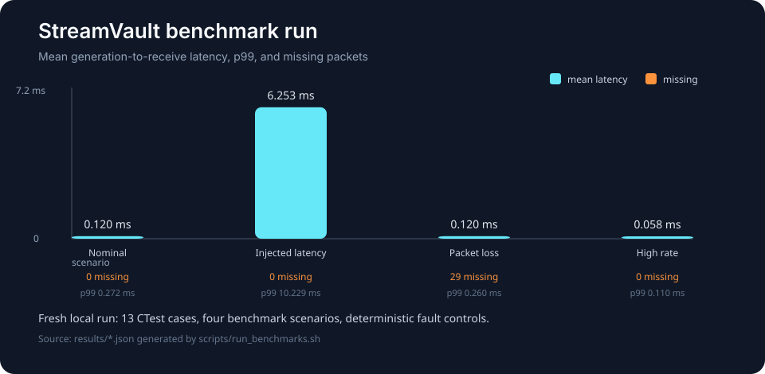

# StreamVault

C++20 telemetry recorder and timed replay pipeline for measuring loss, ordering, latency, and queue pressure in asynchronous sensor streams.



## Why I Built It

Telemetry demos often hide the behavior that matters under loss or load. I built StreamVault as a small, inspectable reference system where packet handling, bounded buffering, timing, and replay can be measured directly.

## What It Does

Three localhost UDP producers emit IMU-like, GPS-like, and temperature-like records. A recorder validates packets, tracks sequence gaps, measures generation-to-receive latency, writes a binary session through a bounded queue, and emits a JSON summary. A replay tool reproduces observed receive-time spacing at a chosen speed.

## Key Engineering Work

- Defined and validated explicit UDP and binary-session formats.
- Separated UDP reception from disk I/O with a bounded queue and writer thread.
- Added deterministic loss, delay, and jitter injection with seeded randomness.
- Added sequence-gap, queue, and latency statistics, including percentiles.
- Added GoogleTest coverage and a real localhost UDP integration test.
- Added reproducible demo and benchmark scripts plus Ubuntu CI.

## Architecture

```text
IMU / GPS / temperature producers
              │ UDP
              ▼
receive + validate + timestamp ──► bounded queue ──► session writer
              │                                      │
              └──────────── JSON summary ◄───────────┘
                                                     │
                                                     ▼
                                               timed replay
```

The receive loop remains responsible for packet validation and ordering observations. A dedicated writer owns session-file output, so a slow disk does not directly block the socket loop. A full queue is reported as a queue drop, while a sequence jump is reported as missing producer traffic.

## Results

The fresh local run passes 13 CTest cases, including localhost UDP integration. The four scenarios measured 0.120 ms mean latency nominally, 6.253 ms under injected latency, 29 missing packets under packet loss, and 5,004 received records in the high-rate case without a queue drop. The benchmark script writes machine-specific JSON under `results/`; generated output is intentionally ignored.

This is a single-host reference implementation. It has no retransmission, authentication, encryption, clock synchronization, file rotation, or cross-machine latency claim.

## Tech Stack

C++20, POSIX sockets, CMake, GoogleTest, CTest, Bash, Ubuntu, GitHub Actions.

## Running Locally

```bash
./scripts/setup_ubuntu.sh
cmake -S . -B build -DCMAKE_BUILD_TYPE=Release
cmake --build build -j
ctest --test-dir build --output-on-failure
./scripts/run_demo.sh
./scripts/run_benchmarks.sh
```

The demo records a short session, validates its JSON summary, and replays it. Start the recorder and producers manually when you want to inspect individual command-line options:

```bash
./build/streamvault_recorder --output recordings/session.dat --summary results/session.json
./build/imu_producer --hz 100 --drop-rate 0.02 --delay-ms 5 --jitter-ms 3 --seed 42
./build/streamvault_replay recordings/session.dat --speed 2.0
```

MIT License.
