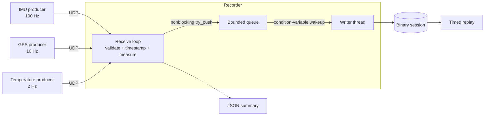

# StreamVault

A C++20 telemetry recorder and replay system built to make timing, loss, and ordering in asynchronous sensor streams observable and repeatable.

StreamVault runs three independent IMU-like, GPS-like, and temperature-like producers over localhost UDP. A central recorder validates datagrams, measures timing and loss, passes records through a bounded queue, and writes a binary session from a dedicated thread. The replay tool reproduces the recorder's original receive-time spacing at configurable speeds.

This is a bounded, single-host reference implementation rather than production telemetry infrastructure. It is intentionally explicit about its wire format, queue behavior, timestamps, and failure modes so the measurements can be inspected instead of inferred.

## Demo / Results

The supplied benchmark script runs baseline, injected-loss, injected-latency, and high-rate cases. On the verified reference run, the loss case found 29 missing packets and the high-rate case recorded 5,008 packets without a queue drop. `ctest` passes 13 cases, including a real localhost UDP integration test, and the same build is exercised by Ubuntu CI.

```bash
./scripts/run_demo.sh
./scripts/run_benchmarks.sh
```

Generated sessions and summaries are written under `recordings/` and `results/`; they are intentionally ignored so results always correspond to the machine and revision being tested.

## What I Built

- Five focused executables with useful `--help` output
- Explicit, versioned binary wire and session formats
- Real sequence-gap, queue-pressure, and latency measurements
- Deterministic packet loss, delay, and jitter injection
- RAII-managed POSIX sockets, files, and joinable threads
- GoogleTest coverage plus a real localhost UDP integration test
- Reproducible demo, four benchmark scenarios, and Ubuntu CI

## Running It

```bash
./scripts/setup_ubuntu.sh
cmake -S . -B build -DCMAKE_BUILD_TYPE=Release
cmake --build build -j
ctest --test-dir build --output-on-failure
./scripts/run_demo.sh
```

## How It Works



Each producer is single-threaded. It schedules generation with `steady_clock`, timestamps a message with `system_clock`, applies deterministic fault injection, serializes it, and calls `sendto`. The recorder's main thread polls the socket, calls `recvfrom`, validates each packet, captures its receive timestamp, updates statistics and sequence state, and makes one nonblocking queue insertion attempt. The writer thread waits on a condition variable and is the only code that writes session records.

Disk I/O is separated from UDP reception so a slow write does not directly stall the receive loop. The bounded queue prevents unlimited memory growth. If it is full, the already-received record is discarded and `queue.drops` increases. This is intentionally different from a sequence gap, which estimates a message that never reached normal recorder processing.

## UDP and message format

UDP makes packet loss, datagram boundaries, ordering behavior, and asynchronous arrival visible without hiding them behind a reliable byte stream. It is also simple and low-overhead, but it provides no delivery, duplicate suppression, or ordering guarantee. TCP would provide reliable ordered bytes, at the cost of head-of-line blocking and less direct observation of telemetry loss.

All multibyte fields use network byte order. Floating-point values are finite IEEE-754 binary64 bit patterns encoded as big-endian 64-bit words. The packet header is exactly 32 bytes.

| Offset | Size | Field |
|---:|---:|---|
| 0 | 4 | Magic `SVLT` |
| 4 | 2 | Format version, currently 1 |
| 6 | 2 | Type: IMU 1, GPS 2, temperature 3 |
| 8 | 4 | Source ID: IMU 1, GPS 2, temperature 3 |
| 12 | 8 | Sequence number |
| 20 | 8 | Generation time, signed Unix nanoseconds |
| 28 | 4 | Payload byte count |
| 32 | variable | Six, two, or one binary64 values |

The decoder checks magic, version, total and payload lengths, known types, the source/type pairing, expected value count, and finite values. There is deliberately no checksum in version 1.

## Session format and ordering

A session starts with `SVS1`, a 16-bit version, and a reserved 16-bit zero. Each following record has a 32-bit length and then source ID, type, reserved field, sequence, generation timestamp, receive timestamp, payload byte length, and payload. Readers cap record size and reject invalid, corrupted, or truncated input.

The single receive thread enqueues records in receive order and the single writer preserves that order. Both timestamps remain in each record. Generation-to-receive latency is useful while every process uses the same host clock. One-way latency across machines requires clock synchronization and an analysis of clock error. Receive timestamps drive replay because they capture the recorder's observed timing.

Sequence tracking keeps the highest sequence seen for each source. A forward jump contributes `new - previous - 1` missing messages. Duplicates and older out-of-order datagrams do not lower the high-water sequence or create false gaps. The first observed sequence establishes a baseline, so loss before recording begins cannot be measured.

## Fault injection and statistics

Every producer supports intentional drops, fixed delay, and uniform integer jitter around the fixed delay. Delay is clamped to zero. The supplied seed initializes `std::mt19937_64`, so the same options and seed reproduce the same fault decisions. An intentional drop still advances the sequence number.

The shutdown JSON reports duration, malformed packets, queue capacity/high-water/drop counts, per-source received and missing counts, and measured mean, minimum, maximum, p50, and p99 generation-to-receive latency. Percentiles use nearest rank after sorting samples. Negative latency is retained rather than hidden because a wall-clock adjustment is itself relevant evidence.

## Tests

Ubuntu dependencies can be installed with:

```bash
./scripts/setup_ubuntu.sh
cmake -S . -B build -DCMAKE_BUILD_TYPE=Release
cmake --build build -j
ctest --test-dir build --output-on-failure
```

GoogleTest is the only nonstandard test dependency. CTest discovers each meaningful GoogleTest case separately, including a localhost UDP test.

## Usage

Start the recorder, then start any or all producers in other terminals:

```bash
./build/streamvault_recorder --output recordings/session.dat --summary results/session.json
./build/imu_producer --hz 100 --drop-rate 0.02 --delay-ms 5 --jitter-ms 3 --seed 42
./build/gps_producer --hz 10 --seed 43
./build/temperature_producer --hz 2 --seed 44
```

Stop processes with Ctrl-C. Replay at original speed, half speed, twice speed, or without sleeping:

```bash
./build/streamvault_replay recordings/session.dat --speed 1.0
./build/streamvault_replay recordings/session.dat --speed max
```

Every executable supports `--help`. Producers accept `--host` and `--port`; the recorder accepts `--bind`, `--port`, and `--queue-capacity`.

## Demo and benchmarks

After building, run:

```bash
./scripts/run_demo.sh
./scripts/run_benchmarks.sh
```

The demo records for five seconds, validates its JSON, prints measured statistics, and replays at 2x. Benchmarks run four short scenarios and write actual results to `results/nominal.json`, `results/latency.json`, `results/packet_loss.json`, and `results/high_rate.json`. They assert successful execution and valid JSON but intentionally define no invented performance threshold.

## Design decisions and limitations

Custom serialization keeps the wire representation small enough to explain byte by byte and avoids bringing Protobuf into an educational project. The cost is manual schema evolution, validation, and interoperability work. RAII closes sockets and files, joinable threads make lifetimes explicit, and mutex/condition-variable queue code demonstrates the underlying concurrency rather than hiding it behind a library.

Version 1 assumes one producer for each fixed source ID on one IPv4 host. It has no checksum, retransmission, authentication, encryption, compression, schema negotiation, clock synchronization, index, file rotation, live query interface, or UDP replay. A producer restart reuses low sequence numbers and is treated as older traffic. `system_clock` can jump, UDP kernel-buffer drops cannot be distinguished from network drops, and sequence gaps cannot identify loss before the first packet or prove why a packet was absent.

Reasonable extensions are explicit producer-instance IDs, monotonic-clock correlation, checksums, session indexing, file rotation, batched writes, configurable socket buffers, richer duplicate/reordering statistics, and cross-machine clock-quality metadata. Those are omitted to keep this version small and studyable.
